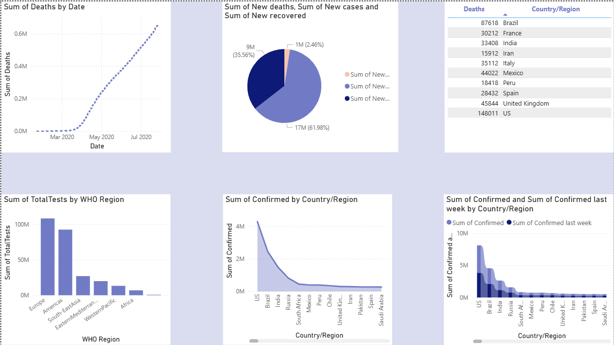

# COVID-19 Dashboard 📈

## 📊 Overview
This project presents an interactive COVID-19 dashboard built using Power BI to analyze global cases, deaths, recoveries, and trends over time.

## 🛠️ Tools
- Power BI

## 📈 Key Insights
- Tracked COVID-19 cases and deaths over time
- Compared confirmed cases across countries
- Analyzed testing distribution by WHO regions
- Identified trends in new cases, deaths, and recoveries

## 📊 Dashboard Preview

## 📂 Files
- `covid-dashboard.pbix` → Power BI dashboard file
- `images/` → Dashboard screenshots

## 🚀 How to Use
- Download the `.pbix` file
- Open it using Power BI Desktop
- Explore the interactive dashboard
